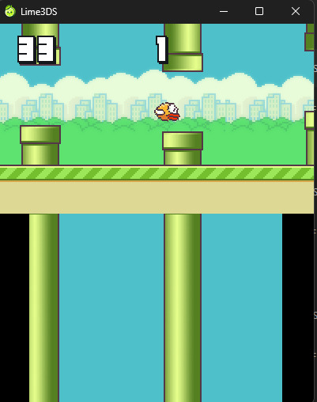

# 3DS Flappy

A Nintendo 3DS CITRO2D Flappy bird clone.

# Building

Requires devkitPro with the Nintendo 3DS toolchain

## Building instructions

I built everything using Windows 10

* Install [devkitpro](https://devkitpro.org/wiki/Getting_Started#Unix-like_platforms)

* Clone this repo
* `cd 3ds-flappy`
* `make`

# Preview

  

